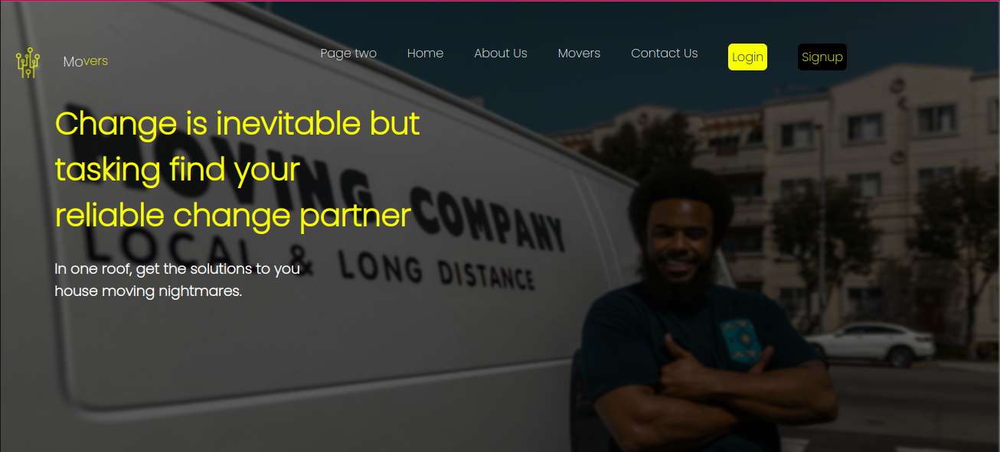

# Moringa School
 ## By Brian Kimutai Koskei
## Screenshot
 
 ## Table of Content
 - [Description](#description)
 - [Top Movers](#Top-movers)
 - [Movers Details](#Movers Details)
 - [Portfolio](#Portfolio)
 - [Installation Process](#installation-Process)
 - [Live Link](#Live-Link)
 - [Technology  Used](#technology-Used)
 - [Licence](#licence)
 - [Authors Info](#Authors-Info)
 ## Description
 
TThis is the Quick Movers Company's website. The firm specializes in relocating household goods from one location to another. The website lists the top local swift movers and their contact information.

## Top movers
This section tells more about the best household movers in town.
[Go Back to the top](#Screenshot)

## Movers Details
This section gives the contacts of the movers and some of their works.
[Go Back to the top](#Screenshot)

 ###  Requirements
 * Access to  a computer or any other garget
 * Access to internet
 ### Installation Process
 ****
* Clone to thir repo : git clone git@github.com:borebrian2021/Moringa-Quick-Movers-Website.git
* Unzip the downloaded files in a folder of choice.
* Open the index file from the zipped file with any browser.
 ****
 [Go Back to the top](#Screenshot)
### Live Link
- Click this link to view the live application https://borebrian2021.github.io/Naturing-Africas-Tech-Talent/#Courses
### Technology  Used
* HTML - which was used to develope the structure off the pages.
* CSS - which was used to style the User Interface.
[Go Back to the top](#delani-studio)

## Licence
MIT License
Copyright (c) [2022] [Brian Kimutai]
Permission is hereby granted, free of charge, to any person obtaining a copy
of this software and associated documentation files (the "Software"), to deal
in the Software without restriction, including without limitation the rights
to use, copy, modify, merge, publish, distribute, sublicense, and/or sell
copies of the Software, and to permit persons to whom the Software is
furnished to do so, subject to the following conditions:
The above copyright notice and this permission notice shall be included in all
copies or substantial portions of the Software.
THE SOFTWARE IS PROVIDED "AS IS", WITHOUT WARRANTY OF ANY KIND, EXPRESS OR
IMPLIED, INCLUDING BUT NOT LIMITED TO THE WARRANTIES OF MERCHANTABILITY,
FITNESS FOR A PARTICULAR PURPOSE AND NONINFRINGEMENT. IN NO EVENT SHALL THE
AUTHORS OR COPYRIGHT HOLDERS BE LIABLE FOR ANY CLAIM, DAMAGES OR OTHER
LIABILITY, WHETHER IN AN ACTION OF CONTRACT, TORT OR OTHERWISE, ARISING FROM,
OUT OF OR IN CONNECTION WITH THE SOFTWARE OR THE USE OR OTHER DEALINGS IN THE
SOFTWARE.
[Go Back to the top](#Screenshot)
## Authors Info
Linkedin - [Brain Koskei Kimutai](https://www.linkedin.com/in/bore-brian-5655b814b/)
<!-- [Go Back to the top](#delani-studio) -->